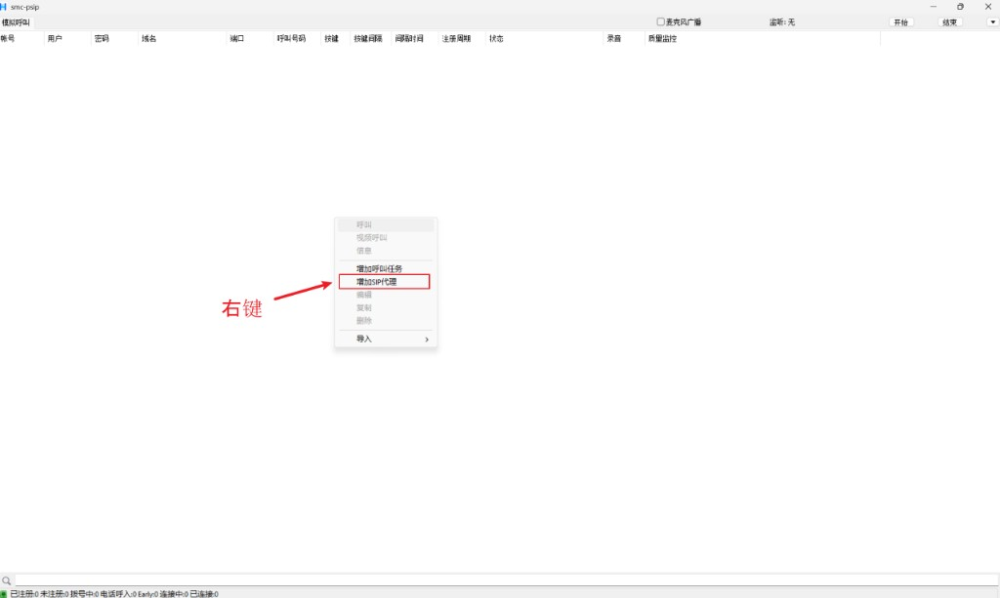
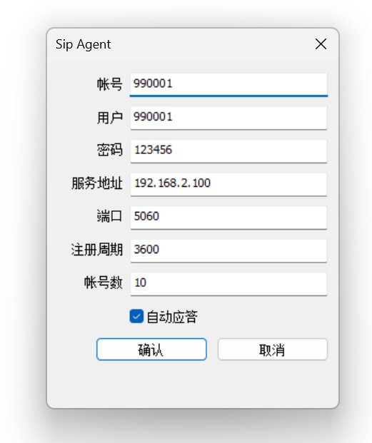
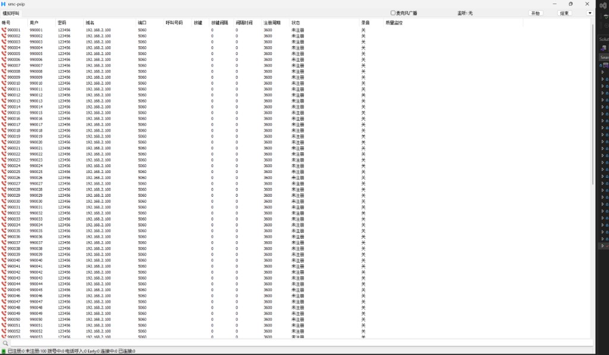
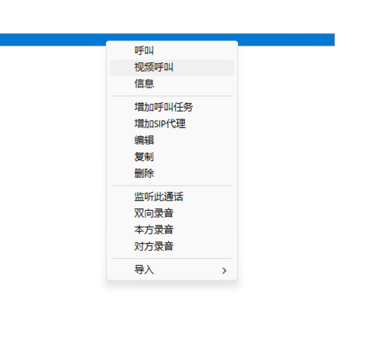
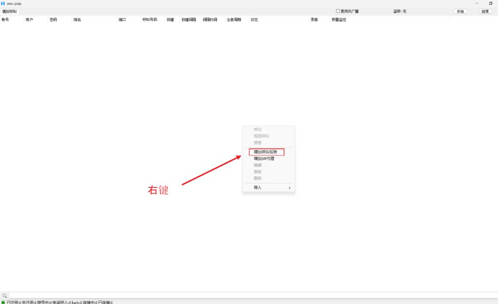
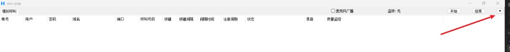
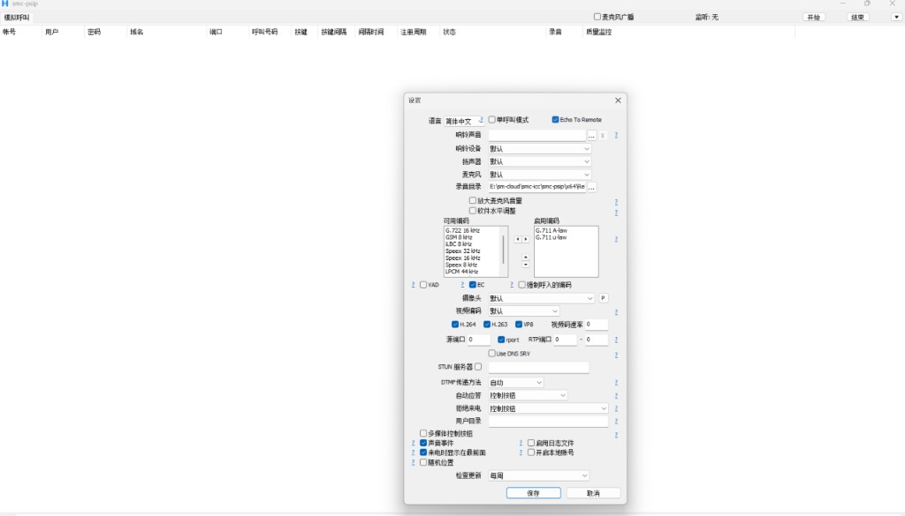

# smc-psip

Windows 批量 SIP 软电话 / 呼叫模拟器。基于 [PJSIP](https://www.pjsip.org/) 与 [MicroSIP](https://www.microsip.org/) 改造，用于多账号注册、批量外呼、IVR DTMF、通话录音与监听。

当前版本 **1.1.0**。[English](README.en.md) · 下载：[GitHub Releases](https://github.com/smc-icc/smc-psip/releases/latest)

> 这是带界面的批量模拟客户端，不是专用压测引擎。并发上限受 PJSIP 编译宏约束（默认最多 1024 路通话）。

## 功能

- **批量账号**：添加外呼账号或 SIP 坐席，支持号码递增、CSV 导入
- **批量外呼**：队列调度，约 20 CPS，避免瞬时打满对端
- **媒体路径**：默认不把所有通话混进本机声卡；放音文件接到各路通话
- **DTMF / IVR**：接通后发送 `123#`，或按时间轴 `1@3|2@8`（第 3 秒发 1、第 8 秒发 2），每步只发一次
- **录音**：右键选双向 / 本方 / 对方；未选不录。默认目录为 exe 旁的 `records`
- **监听与麦广播**：只把当前监听的一路接到喇叭；可选把麦克风广播到全部通话
- **编解码**：默认 `PCMA/8000`、`PCMU/8000`
- **界面语言**：设置里选「简体中文」，并将 `langpack_zh.txt` 放在 exe 同目录

## 环境要求

| 项 | 说明 |
| --- | --- |
| 系统 | Windows 10/11，建议 x64 |
| IDE | Visual Studio 2022（含使用 C++ 的桌面开发、MFC） |
| 解决方案 | `pjproject-vs14.sln` |
| 推荐配置 | **Release \| x64** |
| 其他 | [Git LFS](https://git-lfs.com/)、[7-Zip](https://www.7-zip.org/) |

x64 可执行文件使用动态 CRT，运行机器需要安装 [VC++ 2015–2022 x64 运行库](https://learn.microsoft.com/zh-cn/cpp/windows/latest-supported-vc-redist)。

## 获取源码与依赖

`third_party/` 源码树不进 Git，以 Git LFS 分卷归档。仓库里只跟踪 `third_party/build` 工程文件。

```bash
git lfs install
git clone <仓库地址>
cd smc-psip

# 从分卷解压到仓库根目录，与已有 third_party/build 叠在一起
7z x third_party.7z.001
```

工作区里如果已经有完整的 `third_party/`，不要删。解压只给干净克隆使用。

未安装 Git LFS 时，`third_party.7z.*` 只会是指针文件，解压会失败。

## 编译

1. 用 Visual Studio 打开 `pjproject-vs14.sln`
2. 配置选 **Release**，平台选 **x64**
3. 生成解决方案，或只生成项目 `smc-psip`
4. 输出：`x64\Release\smc-psip.exe`（工程目录下也可能是 `smc-psip\x64\Release\`）

### 平台差异

| 平台 | 说明 |
| --- | --- |
| **x64** | 推荐。视频走 DirectShow。仓库内 FFmpeg/SDL 预编译库只有 Win32，x64 已关闭 FFmpeg/SDL |
| **Win32** | 可开 FFmpeg/SDL 视频。应用侧使用静态 MFC |

不要混用 Win32 的 FFmpeg 库去链 x64。

## 运行

1. 把 `langpack_zh.txt` 拷到 exe 同目录
2. 设置 → 语言选「简体中文」，保存后重启
3. 启动 `smc-psip.exe`
4. 配置坐席或外呼任务后点开始

录音文件名格式：`{号码}_{yyyyMMddHHmmss}_{both|local|remote}.wav`。

---

# 操作说明

## 一、主界面


顶部从左到右：页签 **模拟呼叫**、**麦克风广播**、**监听** 提示、**开始**、**结束**、菜单（最右侧下拉）。

| 列表列 | 含义 |
| --- | --- |
| 帐号 | SIP 帐号 |
| 用户 | 显示名 / 认证用户 |
| 密码 | 注册密码 |
| 域名 | SIP 服务器 |
| 端口 | SIP 端口，一般 5060 |
| 呼叫号码 | 被叫（外呼任务填写；坐席可空） |
| 按键 | 接通后发送的 DTMF |
| 按键间隔 | 接通后多少秒再发 DTMF |
| 间隔时间 | 通话时长（秒） |
| 注册周期 | 注册刷新间隔（秒） |
| 状态 | 注册 / 呼叫状态 |
| 录音 | 关 / 双向 / 本方 / 对方 |
| 质量监控 | RTCP 丢包、时延等 |

底栏统计：已注册、未注册、拨号中、电话呼入、Early、连接中、已连接。左下角为列表过滤。

点 **开始** 只把「外呼任务」入队拨打；SIP 坐席只注册、接听，不会被当成外呼打出去。**结束** 停止外呼并挂断相关通话。

## 二、添加批量坐席代理

### 图2：右键入口

在列表**空白处**右键，选 **增加 SIP 代理**。



### 图3：坐席对话框参数



| 参数 | 说明 |
| --- | --- |
| 帐号 | 起始 SIP 帐号，须为数字，例如 `990001` |
| 用户 | 认证用户名，须为数字；与帐号勾选递增时一起加 1 |
| 密码 | 注册密码 |
| 服务地址 | SIP 服务器 IP 或域名 |
| 端口 | 一般 `5060` |
| 注册周期 | 注册超时 / 刷新秒数，例如 `3600` |
| 帐号数 | 从起始帐号起连续添加多少条，例如 `10` 即 990001–990010 |
| 自动应答 | 勾选后坐席来电自动接听 |

点 **确认** 写入列表。帐号已存在的行会跳过。

### 图4：添加结果



添加后状态为「未注册」。点 **开始** 后才会向服务器注册。坐席的「呼叫号码」为空是正常的。

## 三、右键代理操作

选中一行或多行后右键。无选中时，呼叫 / 编辑 / 复制 / 删除 / 监听 / 录音为灰色。



| 菜单 | 功能 |
| --- | --- |
| 呼叫 | 对选中帐号发起语音呼叫（未接通等场景可能不可用） |
| 视频呼叫 | 发起视频呼叫 |
| 信息 | 打开消息窗口 |
| 增加呼叫任务 | 打开批量外呼对话框（见第四节） |
| 增加 SIP 代理 | 打开批量坐席对话框（见第二节） |
| 编辑 | 修改当前选中的一条（外呼走呼叫任务窗，坐席走代理窗） |
| 复制 | 按 CSV 表头复制所有选中行，可粘贴到 Excel 或模板再导入 |
| 删除 | 删除所有选中行 |
| 监听此通话 | 把该路远端声音接到本机喇叭（同时只听一路） |
| 双向录音 | 录本方 + 对方；再点已勾选项则停止 |
| 本方录音 | 只录本方（放音 / 麦克风） |
| 对方录音 | 只录对方 |
| 导入 → CSV | 按 `import_calls_template.csv` 批量导入 |

录音：未接通只记下模式，接通后才写 wav。换模式会停旧文件、按新模式开新文件。默认目录：exe 旁 `records`（可在设置里改）。

## 四、添加批量外呼

在列表空白处右键，选 **增加呼叫任务**。



打开「Call Task」对话框后填写：

| 参数 | 说明 |
| --- | --- |
| 帐号 / 用户 | 起始帐号与用户名，须为数字 |
| 密码 | 注册密码 |
| 服务地址 (Url) | SIP 服务器 |
| 端口 | 一般 `5060` |
| 呼叫号码 | 被叫；可勾选「递增」与帐号同步加 1 |
| 帐号（递增） | 勾选后每条帐号 / 用户 +1 |
| DTMF | 接通后发送的按键，可空 |
| DTMF 间隔 | 接通后等待多少秒再发 DTMF，`0` 表示立即 |
| 帐号数 | 连续添加多少条外呼任务 |
| 通话时长 | 接通后保持秒数 |
| 注册周期 | 注册刷新秒数 |

**DTMF 写法**

| 写法 | 含义 |
| --- | --- |
| `123#` | 接通并等待「DTMF 间隔」秒后，整串发出 |
| `1@3\|2@8` | 从接通起算，第 3 秒发 `1`，第 8 秒发 `2` |

点 **开始** 后，已注册成功的外呼任务会按队列拨打（约 20 CPS）。挂断后约 1 秒冷却再重呼。

也可使用 exe 同目录的 `import_calls_template.csv`：`Type=0` 为外呼，`Type=1` 为坐席。说明见 `import_calls_template.txt`。

## 五、系统与设备设置

### 图7：打开菜单

点窗口右上角菜单按钮（开始 / 结束右侧）。



选 **设置** 打开下图。

### 图8：设置参数



| 参数 | 说明 |
| --- | --- |
| 语言 | English 不加载语言包；简体中文加载 `langpack_zh.txt`。改后需重启 |
| 单呼叫模式 | 切到单路拨号页（本工具一般保持不勾选） |
| Echo To Remote | 把本地放音回传到对端 |
| 响铃声音 | 自定义来电铃声 wav，可浏览或清空 |
| 响铃设备 / 扬声器 / 麦克风 | 音频设备，默认即可 |
| 录音目录 | 录音 wav 保存路径，默认 `exe\records` |
| 放大麦克风音量 | 麦克风软件增益 |
| 软件水平调整 | 软件音量调节 |
| 可用编码 / 启用编码 | 空格启用、Delete 禁用；上下调整优先级。默认 G.711 A-law / u-law |
| VAD | 静音检测，减少静音发包 |
| EC | 回声消除。开立体声编码时可能被压成单声道 |
| 强制呼入的编码 | 呼入时强制本机编码 |
| 摄像头 / 视频编码 / H.264 / H.263+ / VP8 / 视频码速率 | 视频采集与编码 |
| 源端口 | SIP 本地端口，`0` 为自动 |
| rport | 通过 Via rport 发现公网端口 |
| RTP 端口 | RTP 端口范围，`0` 为自动 |
| Use DNS SRV | 用 DNS SRV 解析 SIP 服务器 |
| STUN 服务器 | NAT 穿越，勾选并填写 STUN 地址 |
| DTMF 传递方法 | 自动 / 带内 / RFC2833 / SIP INFO |
| 自动应答 | 否 / 控制按钮 / SIP 头 / 全部来电 |
| 拒绝来电 | 否 / 控制按钮 / 按用户或域过滤 / 全部 |
| 用户目录 | 外部用户目录 URL（可选） |
| 多媒体控制按钮 | 处理键盘多媒体键 |
| 声音事件 | 播放响铃、挂断等提示音 |
| 启用日志文件 | 写 exe 旁日志 |
| 来电时显示在最前面 | 来电时把窗口置前 |
| 开启本地账号 | 无服务器时的本机 SIP 账号 |
| 随机位置 | 来电弹窗随机位置 |
| 检查更新 | 每天 / 每周 / 每月 / 每季度 / 从不。向 [GitHub Releases](https://github.com/smc-icc/smc-psip/releases/latest) 查询，有更高版本 tag 时提示 |

保存后部分选项立即生效；语言必须重启。

## 六、列表多选

- **Ctrl+A**：焦点在通话列表时全选
- **Shift + 单击**：从锚点到当前行的连续选中
- **按住左键拖动**：框选连续区域

选中后可批量删除、复制、设置录音模式。

---

## 使用要点

- 第一路接通会自动监听；右键可改听另一路；挂断后切到下一场仍接通的通话
- 监听和录音互相独立
- 同时开「监听 + 麦广播 + 外放」容易回声，建议耳机并打开回声消除

### 容量

编译期硬顶（`pjlib/include/pj/config_site.h`）：

- 通话 `PJSUA_MAX_CALLS`：1024
- 会议桥端口：1024
- Dialog / 事务 / IOQueue 已按批量场景放大

实际能跑多少路，还取决于机器、编解码和网络。

## 目录结构

```
smc-psip/                 应用（MFC）
pjlib/ pjlib-util/        PJSIP 基础库
pjmedia/ pjnath/ pjsip/   媒体、NAT、SIP
pjsip-apps/               libpjproject 聚合库
third_party/build/        第三方工程文件（进 Git）
third_party.7z.001–013    其余第三方源码与预编译库（Git LFS）
pjproject-vs14.sln        Visual Studio 解决方案
langpack_zh.txt           简体中文语言包
import_calls_template.csv 导入模板
docs/manual/              操作说明截图
```

## 许可

本项目按 **GNU GPL v2** 或更高版本发布，见 [COPYING](COPYING)。

PJSIP、MicroSIP 以及 `third_party` 中的编解码、SRTP 等组件各有其许可证，分发时请一并遵守。

## 致谢

- [PJSIP / PJPROJECT](https://www.pjsip.org/)
- [MicroSIP](https://www.microsip.org/)
